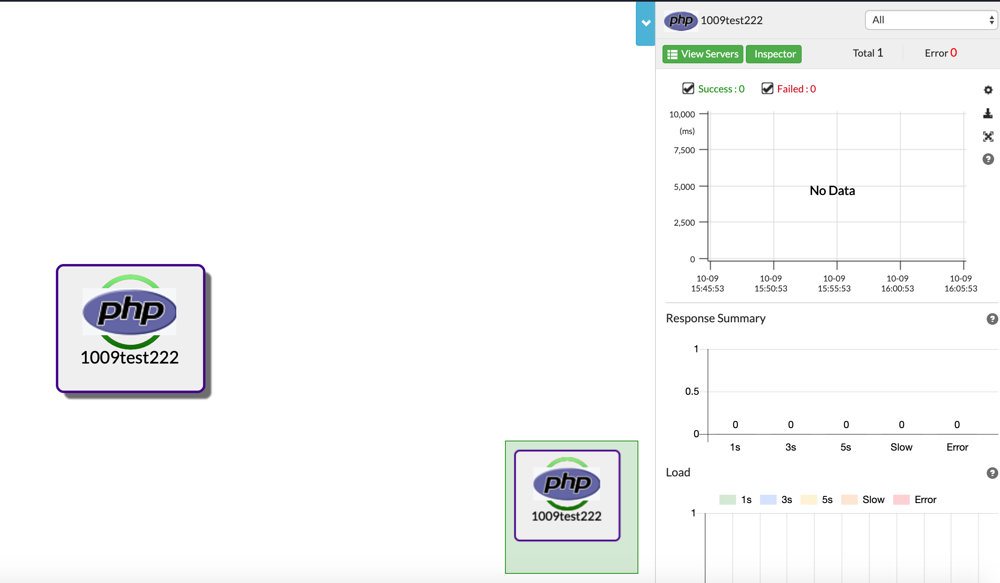
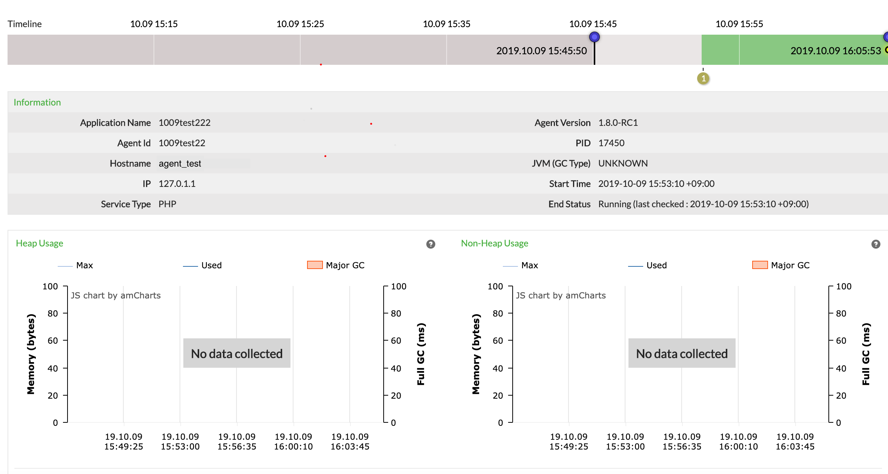

host(Macbook)

both server and agent were run in a vagrant environment.

1. pipoint_server ( pinpoint_docker) -> 192.168.10.19

  the server was installed with docker.
  
  didn't touch anything else.
  
  turn off the firewall with ufw diable.
  


2. pinpoint_agent ( laravel/homestead ) -> 192.168.10.11

  The agent installed pinpoint-c-agent in laravel/homestead running under vagrant
  
  1.install laravel homestead from the root directory of the project
  
  ```
  composer require laravel/homestead --dev
  ```
  
  2.homestead init in the root directory of the project
  
  ```
  php vendor/bin/homestead make
  ```
  3.access the server via ssh connection using ~/.ssh/id_rsa.pub
  
  4. homestead.yaml
  
  ```
  ip: 192.168.10.11
  memory: 2048
  cpus: 1
    folders:
      -
        map: /server_code/
        to: /home/vagrant/code
  sites:
    -
      map: local_domain
      to: /home/vagrant/code/public
  databases:
    - homestead
  ```
  
  5. composer install
  
  6. vagrant up
  
  network setting
  
    ```
    agent-test: Checking if box 'laravel/homestead' version '6.4.0' is up to date...
    agent-test: Clearing any previously set forwarded ports...
    agent-test: Fixed port collision for 80 => 8000. Now on port 2200.
    agent-test: Fixed port collision for 443 => 44300. Now on port 2201.
    agent-test: Fixed port collision for 3306 => 33060. Now on port 2202.
    agent-test: Fixed port collision for 4040 => 4040. Now on port 2203.
    agent-test: Fixed port collision for 5432 => 54320. Now on port 2204.
    agent-test: Fixed port collision for 8025 => 8025. Now on port 2205.
    agent-test: Fixed port collision for 27017 => 27017. Now on port 2206.
    agent-test: Fixed port collision for 22 => 2222. Now on port 2207.
    agent-test: Clearing any previously set network interfaces...
    agent-test: Preparing network interfaces based on configuration...
    agent-test: Adapter 1: nat
    agent-test: Adapter 2: hostonly
    agent-test: Forwarding ports...
    agent-test: 80 (guest) => 2200 (host) (adapter 1)
    agent-test: 443 (guest) => 2201 (host) (adapter 1)
    agent-test: 3306 (guest) => 2202 (host) (adapter 1)
    agent-test: 4040 (guest) => 2203 (host) (adapter 1)
    agent-test: 5432 (guest) => 2204 (host) (adapter 1)
    agent-test: 8025 (guest) => 2205 (host) (adapter 1)
    agent-test: 9600 (guest) => 9600 (host) (adapter 1)
    agent-test: 27017 (guest) => 2206 (host) (adapter 1)
    agent-test: 22 (guest) => 2207 (host) (adapter 1)
    ```
    
  7. vagrant ssh
  
  8. proceed in the order listed at https://github.com/naver/pinpoint-c-agent
  
    all runs were root.
    
  9. ufw disable
  
  
  I think it should be done here, but I also modified php.ini used by laravel.
  
  10. add line to /etc/php/7.2/fpm/php.ini
  
  ```
  extension=pinpoint_php.so
  ; must be unix:(unix sock address)
  pinpoint_php.CollectorHost=unix:/tmp/collector-agent.sock
  pinpoint_php.SendSpanTimeOutMs=0 # 0 is recommanded
  ;request should be captured duing 1 second. < 0 means no limited
  pinpoint_php.TraceLimit=-1
  pinpoint_php.DebugReport=true
  log_errors = On
  error_log = /home/vagrant/fpm.log
  ```
  
  11. add line to /etc/php/7.2/cli/php.ini
  
  ```
  extension=pinpoint_php.so
  ; must be unix:(unix sock address)
  pinpoint_php.CollectorHost=unix:/tmp/collector-agent.sock
  pinpoint_php.SendSpanTimeOutMs=0 # 0 is recommanded
  ;request should be captured duing 1 second. < 0 means no limited
  pinpoint_php.TraceLimit=-1
  pinpoint_php.DebugReport=true
  log_errors = On
  error_log = /home/vagrant/cli.log
  ```
  
  in all log files
  ```
  [2019-10-09 06: 53: 10,431] [INFO] [StreamClientLayer.py:124] try to connect :( '192.168.10.19', 9994) with timeout: 5
  [2019-10-09 06: 53: 10,432] [INFO] [StreamClientLayer.py:71] connect peer: [192.168.10.19:9994] success
  ```
  i only got this line.
  
  and still no data on web ui
  



